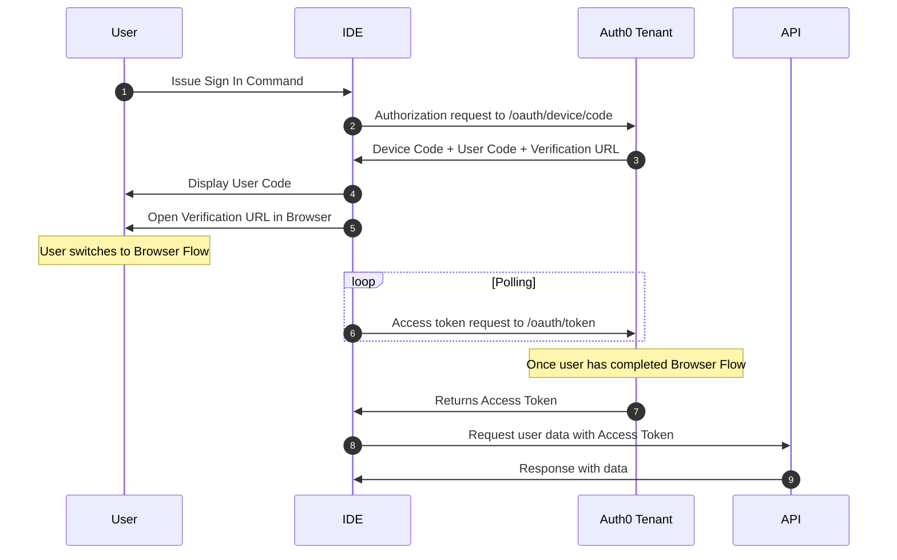
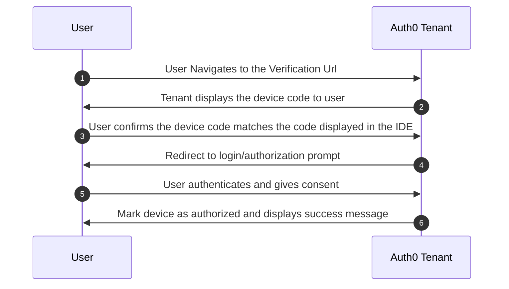
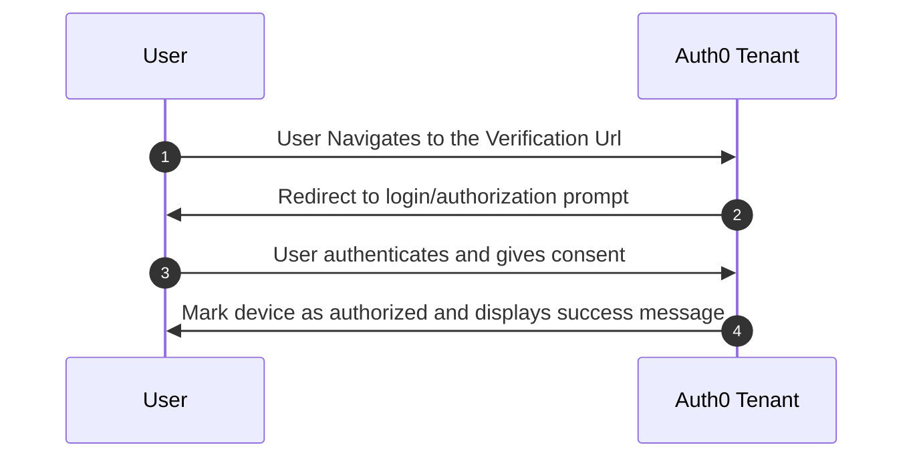

# VSCode Extension Device Code Flow
A fully functioning demonstration of authentication and authorization for a visual studio code extension using OAuth 2 device code flow.

## Terminology
 - **IDE** - An integrated development environment is used by software engineers to build software. Typically includes a text editor combined with a compiler in a convenient way.
    - **Examples:** emacs, XCode, Visual Studio Code
- **Extension/PlugIn** - In this context, an extension is a 3rd party addition to an existing IDE that extends its functionality. Typically this extended functionality is to aid developer productivity.
- **API Key** - Similar to an access token, an API Key is a string used to gain access to an API. They are long lived and typically are issued on a per developer basis. They are a simple way to integrate with an external service.

## Problem Definition

There are a number of service-based SaaS companies that offer developer tooling that integrates with common software development environments (IDE) to provide interactivity with their service. As an example, consider [Twilio](https://marketplace.visualstudio.com/items?itemName=Twilio.vscode-twilio) and [Vonage](https://marketplace.visualstudio.com/items?itemName=Vonage.vscode)'s VSCode Extensions. A common pattern for authorization is to have the user retrieve an API key from the service and configure the developer tool using it.

This of course leads to the propagation of API keys in insecure ways where the key is exposed to leakage and usage in ways they was not issued for specifically. A better solution would be to require the user to communicate with an authorization server to gain access to the API in a limited secure method that does not expose the API keys outside of the running instance of the developer tool.

## Use Cases
 - As a software engineer, when I am developing integrations with 3rd party services, I would like to stay in the context of my software development workflow so that I do not have to switch to a browser to manage/gather information form those 3rd party services.
 - As a SaaS, when offering API access to software developers for my platform, I would like to limit the scope of access to the context of the task at hand by the devloper so that there are ample opprotunities to make authorization decisions. 

## Solution Overview

Device code flow uses a disconnected workflow that is tied together by matching a Device Code via both sides of the workflow. This workflow begins in the IDE, transfers to the User's browser, and returns to the IDE for completion.

### The IDE Client 

The IDE is configured to do Device Code Grant to get id, access and refresh tokens. Once authorized, when the user interacts with the extension features, it can use the access token to authorize request to the external API.

1. User issues the sign in command to the IDE.
2. The IDE makes a POST request to the `/oauth/device/code` endpoint on the Auth0 Tenant passing the following elements:
    - Extension Client ID
    - API Audience
    - Requested Scopes
3. The Tenant responds with:
    - Device Code
    - User Code
    - Verification URL
4. The IDE displays the User Code to the user
5. The IDE prompts the user to open the Verification URL in the system browser.
6. At this point the flow splits with the user entering the Browser Flow and the IDE begins polling the `/oauth/token` endpoint of the Auth0 tenant.
7. Once the user has completed the Browser Flow, the Auth0 Tenant returns requested tokens to the IDE.
8. The IDE request user data using the Access Token.
9. The API responds with the data.

### The System Browser

1. IDE opens system browser to the Verification Url on the Auth0 Tenant.
2. Tenant displays the device code to the user.
3. User confirms the device code displayed matches the device code displayed in the IDE.
4. Tenant redirects to the Universal Login `/login/authorization` prompt.
5. User authenticates and gives consent to requested scopes.
6. Auth0 Tenant markes device as authorized and displays success message.
7. User returns to IDE in the process of completing the IDE flow.

## Implementation Details

### Basic Implementation

1. Add command references to package.json manifest. Command text should be name spaced in a meaningful way to avoid command text collisions with other extensions.
2. Register command texts with command handlers. It is a good idea to seperate UI related implementation from low level implementation communicating with the authorization server.
3. Implement command handlers to interact with the user through status updates and display messages.
4. Token recieved should be stored securely using builtin storage APIs
5. Implement token fetching asyncronously to provide an opprotunity to detect token expiration and request new token sets using the refresh token.
6. Implement a notification mechanism to notify listeners of authorization status changes.

### Dependencies
 - 

## Considerations/Concerns

### Known Issues and Risks

### Expected Maintenance

## Samples/Proof of Concept

## Features

Describe specific features of your extension including screenshots of your extension in action. Image paths are relative to this README file.

For example if there is an image subfolder under your extension project workspace:

\!\[feature X\]\(images/feature-x.png\)

> Tip: Many popular extensions utilize animations. This is an excellent way to show off your extension! We recommend short, focused animations that are easy to follow.

## Requirements

If you have any requirements or dependencies, add a section describing those and how to install and configure them.

### Device Flow

### Browser Flow

